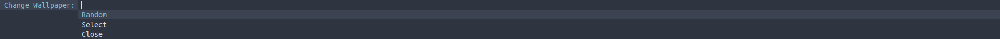

# scripts-pixelfiles

Some Scripts for [pixelfiles](https://github.com/mohannadk28/pixelfiles/)

---

## Shell Scripts:
1. xkbswitch
   to switch Layouts from arabic to english
2. screenshot
   to take screenshots of the desktop
3. copy
   to copy strings to the clipboard

---

## Dmenu Scripts:
1. bye
   Inspired by DT's ByeBye GTK App this is a power off menu for dwm
2. wallchange
   a utilty to change wallpapers either randomly or using nitrogen
3. webmark
   a utilty to quickly launch qutebrowser's quickmarks
